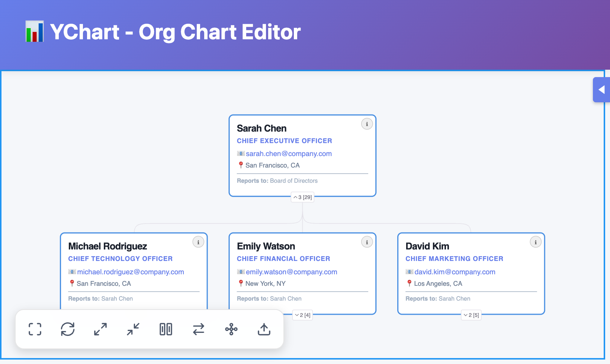
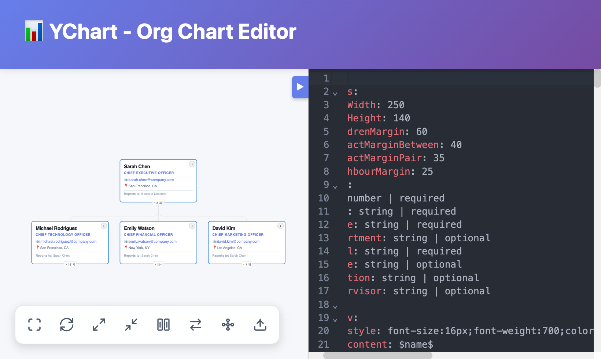
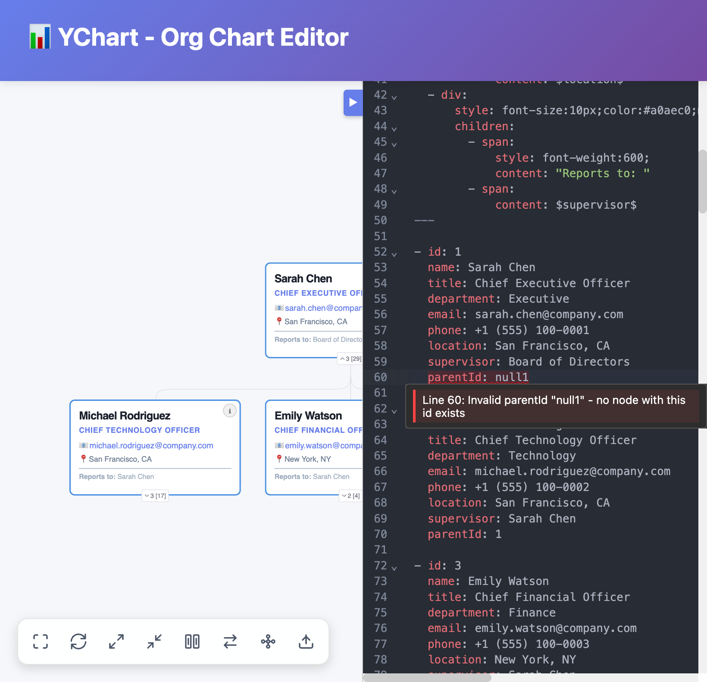
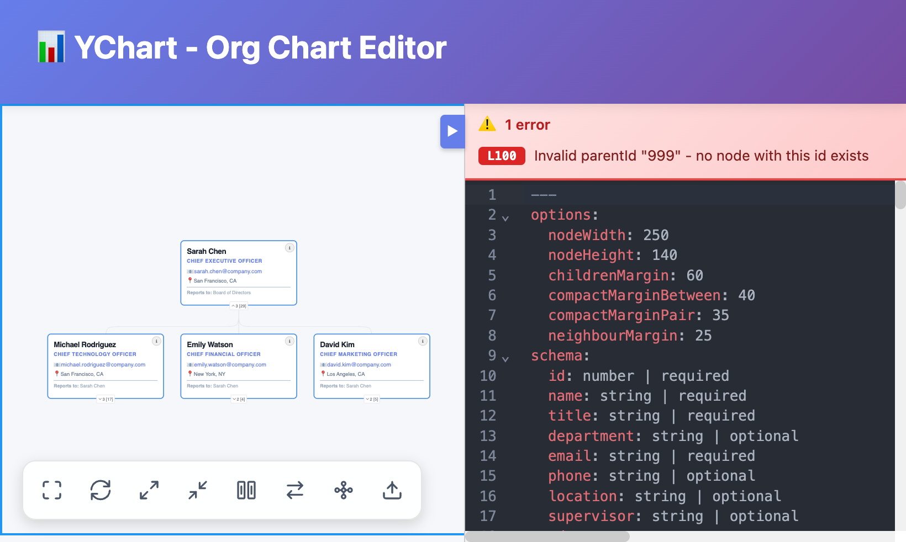
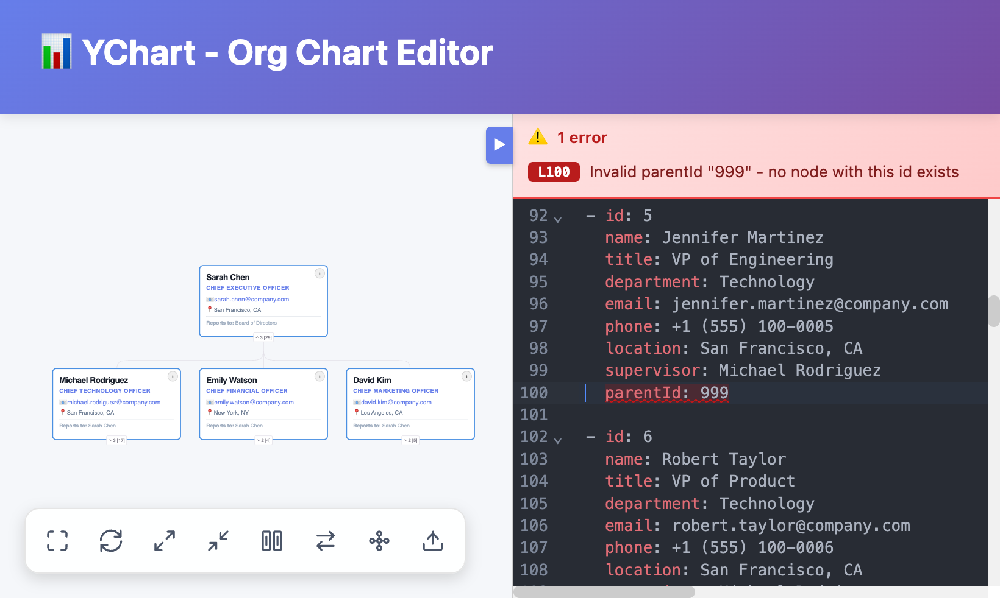

# YChart Editor Documentation

This documentation covers the YAML editor features including real-time linting, error reporting, and keyboard navigation.

## Editor Panel

The editor panel provides a full-featured YAML editing experience with syntax highlighting and real-time chart updates:



### Features

- **Syntax highlighting** - YAML-aware highlighting via CodeMirror
- **Real-time updates** - Chart updates as you type
- **Dark theme** - Uses the OneDark theme for comfortable editing
- **Error banner** - Shows validation errors above the editor
- **Collapsible** - Toggle with the collapse button or keyboard shortcut

The editor panel can be toggled using the collapse button or the keyboard shortcut:



## Keyboard Shortcuts

| Shortcut | Action |
|----------|--------|
| `Ctrl + \`` | Toggle editor panel and scroll to selected node |

### Toggle Editor & Find Selected Node

Press `Ctrl + \`` (Control + backtick) to:

1. **If editor is closed** - Open the editor and scroll to the currently selected chart node's YAML definition
2. **If editor is open** - Close the editor panel

This is useful when you select a node in the chart and want to quickly edit its properties in the YAML.

## YAML Linting & Validation

YChart includes real-time YAML validation powered by CodeMirror's linting infrastructure. The editor validates both syntax and semantic correctness of your org chart data.

### Validation Features

The linter checks for:

1. **YAML Syntax Errors** - Invalid YAML formatting, indentation issues, etc.
2. **Data Structure** - Ensures the YAML data is an array of objects
3. **Invalid Parent References** - Detects when a `parentId` points to a non-existent node
4. **Multiple Root Nodes** - Only one node can have `parentId: null` (the root)

### Inline Error Indicators

Errors are highlighted directly in the editor with wavy underlines and gutter markers:



- **Red wavy underline** - Syntax or validation error
- **Yellow wavy underline** - Warning
- **Gutter markers** - Quick visual indicator of lines with issues

### Error Banner

When validation errors exist, an error banner appears above the editor with a summary of all issues:



Each error in the banner includes:
- **Line number button** (e.g., `L15`) - Click to jump directly to the error
- **Error message** - Description of what's wrong

### Jump to Error

Click any line number button in the error banner to instantly navigate to that line in the editor:



The editor will:
1. Scroll the error line into view
2. Highlight the entire line
3. Focus the editor for immediate editing

## Error Types

### Syntax Errors

```yaml
# Missing colon
- id 1
  name: John
```

The linter will highlight the malformed line and show the YAML parser's error message.

### Invalid Parent Reference

```yaml
- id: 1
  name: CEO
  parentId: null

- id: 2
  name: CTO
  parentId: 999  # Error: no node with id 999 exists
```

### Multiple Root Nodes

```yaml
- id: 1
  name: CEO
  parentId: null

- id: 2
  name: Another CEO
  parentId: null  # Error: only one root node allowed
```

Only the first root node is valid; subsequent nodes with `parentId: null` are flagged as errors.

### Non-Array Data

```yaml
# Error: data must be an array
company: Acme Corp
employees:
  - name: John
```

The org chart data must be a YAML array (starting with `- `), not an object.

## Best Practices

1. **Fix errors before switching views** - Errors may prevent the chart from rendering correctly
2. **Use the error banner** - Click line numbers to quickly navigate to issues
3. **Check parent references** - Ensure all `parentId` values reference existing node `id` values
4. **One root node** - Only one node should have `parentId: null` or omit `parentId` entirely
